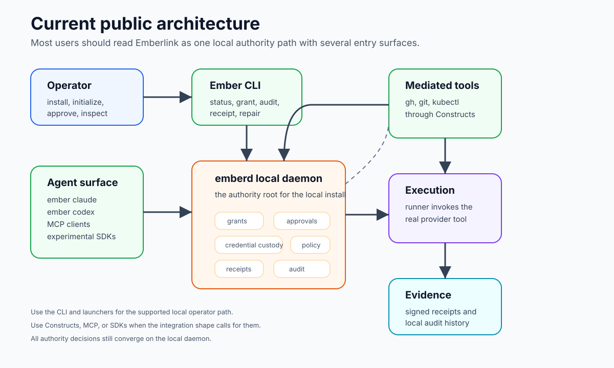

# Architecture Overview

The primary live product is a **local daemon-centered system**.

`emberd` is the authority root. Launchers, Constructs, MCP, SDKs, and the CLI
are clients or adapters around that authority root.

The `v0.3.0` public source mirror is intentionally CLI/core scoped. The
Tauri/Svelte GUI source remains outside the public source release until the
desktop app has its own supported public lane.

## System Shape



```text
operator
  |
  | ember init / ember status / ember grant / ember approval
  v
ember CLI
  |
  | local socket
  v
emberd
  |-- vault and credential custody
  |-- grant and approval state
  |-- session registry
  |-- broker registry
  |-- action evaluation
  |-- receipt identity
  |-- audit store
  |
  +--> launcher sessions: ember claude, ember codex
  |
  +--> Constructs: gh and git mediated through bundled shims
  |
  +--> MCP: emberlink-mcp daemon tools
  |
  +--> SDKs: experimental programmatic clients
```

The current live authority path is the local Unix socket. That is the boundary
most public docs should assume unless a page says otherwise.

## Read the Architecture in Layers

```text
operator layer
  install, initialize, launch, inspect, revoke

agent adapter layer
  Claude launcher, Codex launcher, MCP client, SDK client

mediation layer
  bundled Constructs and daemon-facing requests

authority layer
  emberd, grants, policy, custody, caller binding

execution layer
  local trusted runner and Preview isolated runners

evidence layer
  audit events, receipts, receipt verification
```

The layers are not equal trust domains. The authority layer is the root. Other
layers carry requests, execute approved work, or render evidence.

## Main Runtime Roles

### `emberd`

The daemon owns vault/store access, broker registry, session lifecycle, receipt
identity, dashboard state, and local authority decisions.

It is the thing that evaluates grants and policy. It is also the thing that
records receipt and audit evidence.

### `ember` CLI

The CLI is the operator surface. It installs, configures, launches, repairs,
and inspects.

Some commands are part of the main public path. Some deeper commands exist for
repair, debugging, or pre-release workflows. The public contract is narrower
than the full binary.

See [CLI Reference](../reference/cli-reference.md).

### Launchers

Launchers create managed sessions.

- `ember claude` is the current headline managed path.
- `ember codex` is an advanced supported path. Codex starts from native login,
  then Emberlink can import and broker runtime authority with operator consent.

Both launcher paths should be understood as session registration and runtime
binding surfaces around the daemon, not as separate authority roots.

### Constructs

Constructs are mediated wrappers for credential-bearing tools. They preserve
familiar command use while moving authority resolution through `emberd`.

The current public cohort is:

- `ember-gh`
- `ember-git`

Inside a managed session, those artifacts may be installed under familiar tool
names such as `gh` and `git`.

Additional Constructs such as `ember-aws`, `ember-kubectl`, and other provider
lanes are experimental or in flight until they are validated against the same
public operator story.

### MCP

`emberlink-mcp` exposes daemon-backed tools to MCP-capable environments. It is
a real shipped surface, but it is not the main onboarding lane.

### SDKs

The TypeScript and Python SDKs are experimental. They are useful for custom
programmatic integration, but their package and headless contract is still less
settled than the launcher and CLI path.

## Trust Boundary

```text
agent space
  Claude Code / Codex / MCP client / custom agent
  prompts, commands, transcripts, attempted actions

        local request
             |
             v

authority space
  emberd
  grants, policy, custody, receipt signing, audit store

        execution contract
             |
             v

execution space
  local trusted runner or preview isolated runner
  target tool/API receives narrowed materialized authority
```

The architecture is trying to keep agent space from becoming authority space.
An agent can ask. `emberd` decides whether and how authority is released.

## Current Product Truth

- The installed separate-uid daemon posture is the canonical operator path.
- The local Unix socket is the real current trust boundary.
- GitHub App mediation is the preferred GitHub lane; PAT is degraded fallback.
- `ember claude` is the headline friendly path.
- `ember codex` is advanced but supported; it starts from Codex native login,
  then Emberlink can broker runtime authority with operator consent.
- The current public mediated-tool cohort is `ember-gh` and `ember-git`.
- `ember cursor`, `ember gemini`, `ember-aws`, `ember-kubectl`, and additional
  provider/tool lanes are experimental or in flight.
- MCP is Preview.
- SDKs are Experimental.
- Some deeper headless and isolated surfaces are still moving and should be
  treated according to their support labels.

## Current Support Map

| Surface | Label | Current reading |
|---|---|---|
| Installed daemon + CLI inspection | Supported | The primary local operator posture. |
| `ember init --for claude` + `ember claude` | Supported | Headline friendly path. |
| `ember init --for codex` + `ember codex` | Supported | Advanced path; starts from Codex native login, then can broker runtime authority. |
| Bundled `ember-gh`, `ember-git` | Supported | Current `v0.3.0` mediated-tool proof surface. |
| `ember cursor`, `ember gemini` | Experimental | In flight; not part of the validated `v0.3.0` friendly path. |
| Additional Constructs such as `ember-aws`, `ember-kubectl` | Experimental | In flight; not part of the validated `v0.3.0` friendly path. |
| MCP integration | Preview | Real daemon-backed surface, not the main onboarding lane. |
| Isolated/container execution | Preview | Real support boundary, not the default beginner path. |
| TypeScript and Python SDKs | Experimental | Useful for early programmatic clients; contract can move. |
| Third-party Construct publishing | Preview | Model is intentional; external validation and distribution are still settling. |

Use that table when reading deeper references. Code may contain more machinery
than the public contract exposes.

## Where to Go Next

For concepts:

- [Current Primitives](./primitives.md)
- [Runtime Flow](./runtime-flow.md)
- [Security Model](./security-model.md)

For operator reference:

- [Trust and Verification](../reference/trust-and-verification.md)
- [Grants and Approvals](../reference/grants-and-approvals.md)
- [Sandbox and Isolated Execution](../reference/sandbox-and-isolated-execution.md)

For builder surfaces:

- [Constructs and Mediated Tools](../build/constructs-and-mediated-tools.md)
- [Construct Authoring Model](../build/build-a-construct.md)
- [MCP Integration](../build/mcp-integration.md)
