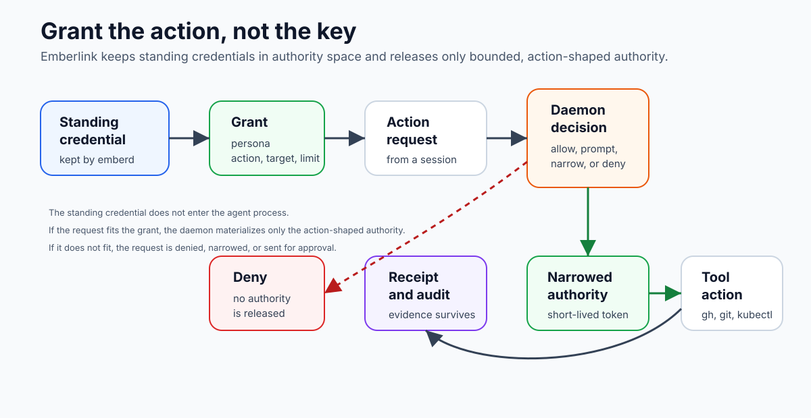

# The Grant Warden Model

AI agents are useful because they can act. They become hard to trust when the
only way to let them act is to give their process a raw credential, an ambient
OAuth session, or a broad platform permission.

Emberlink changes the delegation boundary.

The short version:

> Keep the keys. Grant the action.

The local daemon, `emberd`, is the Warden. It keeps custody of standing
credentials, evaluates whether a requested action fits a grant, materializes
only the authority needed for that action, and records the result as signed
evidence.

The first mental shift is that a credential is not the same thing as authority.

| Thing | What it is | Where it belongs |
|---|---|---|
| Standing credential | Long-lived secret or provider auth material | authority space, under daemon custody |
| Grant | Revocable authority statement for a persona, action, target, and limit | daemon policy state |
| Materialized authority | Short-lived provider-native access for one allowed action or bounded run | execution space |
| Receipt | Signed evidence of the delegated action and decision | portable audit artifact |

Most agent tooling collapses those rows. Emberlink keeps them separate so you
can reason about delegation instead of trusting a process because it happened
to receive a token.

## What the Warden owns

The Warden owns the moment where human authority becomes agent action.

```text
author
  human/operator narrows authority into a grant

act
  agent asks for an action through a launcher, Construct, MCP tool, or SDK

audit
  daemon records the decision and emits receipt evidence
```

Emberlink does not replace your tools. GitHub still handles GitHub. `git` still
handles Git. Kubernetes still handles Kubernetes. Emberlink owns the authority
edge where an agent wants to use those tools on your behalf.

## A Concrete Current Action

The model becomes easier when you trace one action:

```text
agent wants: create a GitHub pull request
tool shape: gh pr create
authority need: pull-request write authority for one repository
daemon role: decide whether an attached grant covers that need
execution role: run the real tool with narrowed materialized authority
evidence: receipt plus audit events
```

That is the whole product in miniature. The Warden is not asking whether the
agent sounds trustworthy. It is checking whether the requested action is inside
current delegated authority.

For the full walkthrough, read
[One Action End to End](./one-action-end-to-end.md).

## What changes for an agent

Without Emberlink, a useful agent often needs standing access:

```text
agent process
  has: repo credential / kubeconfig / cloud key / browser session
  does: any action the standing credential allows
  leaves: vendor logs, shell history, maybe a transcript
```

With Emberlink, the agent asks for an action:

```text
agent process
  has: a session, a tool command, and a declared need
  asks: emberd to resolve authority for one action
  gets: allow, prompt, or deny
  leaves: daemon audit event and receipt evidence
```

The difference is not cosmetic. The agent does not need to hold the raw
standing secret to perform the delegated action.

## Core promises

The Grant Warden model is built around four promises:

- **Bound authority.** A grant says what is allowed, for whom, for how long,
  with what budget or limits.
- **Revocation.** Authority can end without hunting for every process that ever
  saw a token.
- **Action-time mediation.** The daemon evaluates the action when authority is
  requested, not only when a file was configured.
- **Portable evidence.** A receipt survives the session and can be verified
  later.

## What Emberlink is not

Emberlink is not a general-purpose vault. A vault stores sensitive material and
hands it to software. Emberlink is concerned with whether a specific agent
action should receive delegated authority at all.

Emberlink is not an agent runtime. Claude Code, Codex, MCP-capable tools, and
custom shells still own their own agent behavior. Emberlink mediates authority
for the actions those tools try to perform.

Emberlink is not a replacement for platform security. GitHub App permissions,
Kubernetes RBAC, cloud IAM, and local OS permissions still matter. Emberlink
adds a local authority boundary and receipt trail around agent delegation.

## The operating loop



Most of the product can be understood as this loop:

```text
1. A human or policy creates a grant.
2. An agent starts a session.
3. The agent attempts a sensitive action.
4. A launcher, Construct, MCP tool, or SDK carries the request to emberd.
5. emberd compares the requested action with the grant and policy.
6. emberd allows, prompts, narrows, or denies.
7. If allowed, emberd materializes only the authority needed.
8. The action runs.
9. emberd records audit events and receipt evidence.
10. The grant can expire, be narrowed, or be revoked.
```

That loop is the thing to keep in your head as you read the rest of the docs.
Every primitive exists to make one step of that loop explicit.

## How to Know You Have the Model

You understand the Grant Warden model when you can answer these questions for
one sensitive action:

- Which runtime persona is asking?
- Which grant would allow it?
- Which action identity describes it?
- Which resource, scope, target, and budget bound it?
- Which runner class executes it?
- How does authority appear, and where does the standing credential stay?
- What receipt facts would prove the decision later?

If an integration cannot answer those questions, it may still be a useful
wrapper or helper, but it is not yet carrying Emberlink's authority model.

## Next pages

- [Current Primitives](./primitives.md)
- [Runtime Flow](./runtime-flow.md)
- [Security Model](./security-model.md)
- [Grants and Approvals](../reference/grants-and-approvals.md)
