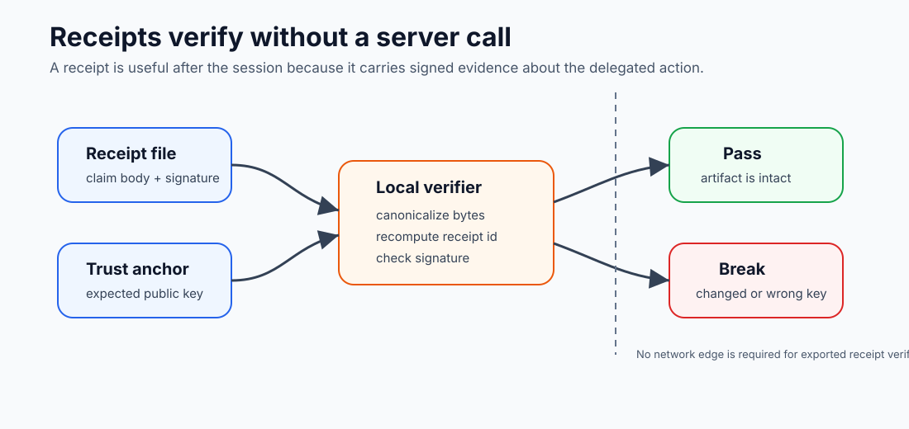

# Receipts and Audit

Emberlink does not just broker authority. It also leaves evidence behind.

The current public evidence model has three parts:

- **Receipts**: signed artifacts describing grant-bearing actions or decisions
- **Audit log**: local event history stored by the daemon
- **Verification**: commands that prove a receipt or audit artifact is structurally valid

## Mental model

Use these terms precisely:

- **Grant**: the scoped authority Emberlink issued for some action
- **Receipt**: the signed artifact that proves what happened
- **Audit event**: the local daemon-side event row that records state and activity history

The receipt is the portable artifact. The audit log is the local history.

## Evidence Flow



```text
action request
  |
  v
grant and policy decision
  |
  v
materialization event
  |
  v
execution result
  |
  v
claim events
  |
  +--> local audit history
  |
  +--> signed receipt artifact
```

The same delegated action can produce local audit history and receipt evidence.
Use the audit log to inspect what happened on this daemon. Use the receipt when
you need a portable artifact.

## What a Receipt Proves

A receipt proves that a daemon identity signed an artifact about a specific
delegated authority event.

For Receipt v2, the common envelope carries fields such as:

- receipt version and kind
- receipt id
- persona id
- grant id
- daemon root id
- start and termination times
- key fingerprint
- trace context
- canonical hash algorithm
- body
- signature

The details matter because verification should not depend on trusting the
current UI, transcript, or host shell. A verifier can rebuild the canonical
bytes and check the signature against the stated key fingerprint.

## Atomic and Session Receipts

There are two useful receipt scopes:

- **Atomic receipts** describe one delegated action or decision.
- **Session receipts** summarize a larger run and can aggregate claim events,
  counts, and roots.

Most first-time users start with the latest receipt export. Builders should
understand that the receipt model is designed to support both one action and a
larger session story.

## Current truth

Today’s shipped surface is:

- the daemon initializes and owns a long-lived receipt identity
- receipts live in the daemon SQLite store
- installed-path `ember receipt ...` commands are largely daemon-backed
- installed-path `ember audit ...` commands are also largely daemon-backed
- some verification and file-based inspection modes remain intentionally local

That means the evidence model is real, but not every inspection path is the
same kind of operation.

## What to use when

### I want to see recent receipt artifacts

Use:

```bash
ember receipt list
ember receipt show <id>
```

### I want a shareable human-readable artifact

Use:

```bash
ember receipt export --latest --format md
```

This is the current public-friendly export path for the latest receipt.

### I want to inspect local audit history

Use:

```bash
ember audit query
ember audit show --limit 20
```

### I want to understand why something happened

Use:

```bash
ember audit explain <id>
```

Important honesty boundary:

- `audit explain` is **current-state explanation**, not pure historical replay
- the event row is historical evidence
- the grant and policy sections reflect the daemon’s current live state

### I want to verify a receipt offline

Use:

```bash
ember receipt verify <path-or-id>
```

Some verification modes intentionally stay daemon-free so an exported artifact
can still be checked later.

## Practical workflow

For most users, the evidence loop is:

1. perform a brokered action
2. inspect `ember receipt list`
3. export the latest receipt if you need a durable artifact
4. use `ember audit ...` when you need more local event detail

## Next page

- [Evidence Reference](../reference/evidence-reference.md)

## Support boundary

The receipt and audit surface is part of the current supported operator story.
What is *not* promised yet is a broader top-level recovery plane or full
historical reconstruction UX beyond the shipped commands.

If you are looking for recovery or repair, start with:

```bash
ember status
ember doctor
ember receipt list
ember audit query
```
