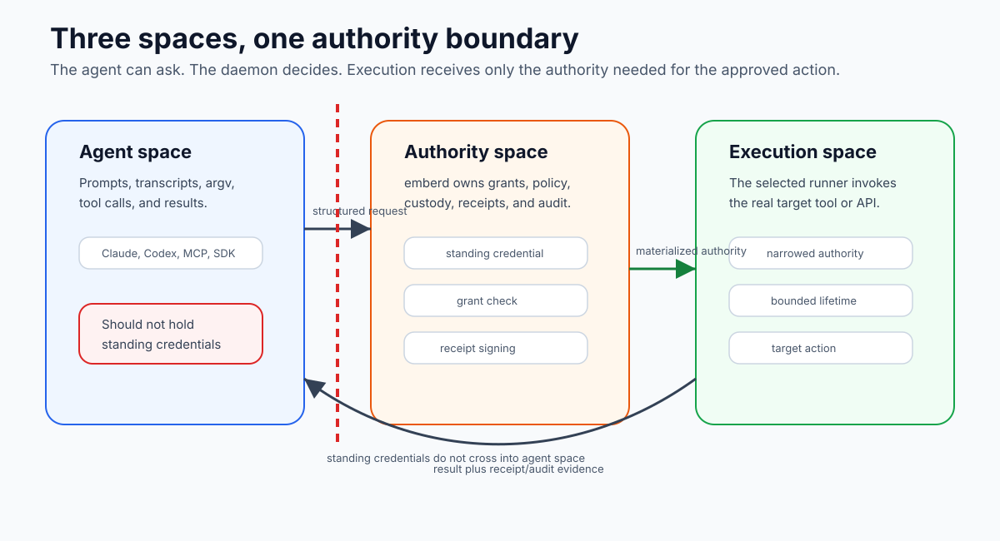

# Security Model

Emberlink is designed around one security claim:

> An agent should be able to act without holding your standing authority.

That does not make every agent action safe. It changes where authority is held,
how it is released, and what evidence survives the release.

## Spaces



Use these terms when reasoning about trust boundaries:

```text
agent space
  agent runtime, prompts, transcripts, shell commands, tool calls

authority space
  emberd, grants, policy, vault custody, receipt identity

execution space
  runner class where the action actually runs
```

The boundary between agent space and authority space is the critical one.
Agent space can ask. Authority space decides.

## What Each Space Sees

| Space | Sees | Should not own |
|---|---|---|
| Agent space | prompt, transcript, argv, tool result, denial or approval outcome | standing credentials |
| Construct shim | command argv, workspace facts, local classification, daemon response | final authority decision |
| Authority space | grants, policy, custody state, caller binding, receipt signing identity | agent reasoning |
| Execution space | narrowed materialized authority needed to run the selected action | broader authority than the grant allows |
| Receipt/audit evidence | decision, action, target, timing, daemon identity, result facts | raw standing secret material |

This separation is the point. A transcript can explain what the agent intended.
A receipt should prove what authority was delegated and what action crossed the
daemon boundary.

## What Emberlink Protects

Emberlink is intended to reduce these risks:

- an agent process holding a long-lived credential
- broad standing authority being reused after the intended task ends
- unclear answers to "who approved this action?"
- unclear answers to "what did the agent actually do?"
- unaudited tool use where credentialed actions look like ordinary shell
  commands

The mechanism is not a single feature. It is the combination of grants,
runtime binding, action classification, materialization policy, execution
contracts, and receipts.

## What Emberlink Does Not Claim

Emberlink does not claim that:

- the agent's reasoning is correct
- the target platform cannot have its own authorization bug
- local malware on the host cannot interfere with the environment
- every command the agent runs is mediated
- every pre-release integration surface has the same hardening level

For v0.3.x, the supported local operator story is stronger than the broader
preview and experimental surfaces. Respect the labels.

## Credential Custody

The important rule is simple: the agent should not need the standing secret.

In the mediated tool path, the Construct sends an action request to `emberd`.
The daemon evaluates grant and policy, then materializes authority for the
action if allowed. The materialized authority should be short-lived, narrowed,
and tied to the action path.

```text
standing credential
  held by: emberd / authority space

materialized authority
  issued for: one action or bounded run
  shaped by: grant + policy + runner class
  recorded by: receipt + audit event
```

## Runtime Binding

Emberlink separates permission from proof of caller.

Permission asks: what is this persona allowed to do?

Caller binding asks: is this runtime actually the session/persona making the
request?

That distinction is why a signed bearer token in an environment variable is not
the target model. An env var can be copied. A runtime binding should be tied to
the process/session boundary the daemon can observe and enforce.

## Constructs as Credential Gates

A Construct is part of the security boundary for credential-bearing command
execution. It does not replace daemon policy. It carries a structured request
from a familiar tool invocation to the daemon.

The daemon still re-classifies and enforces. A malicious or stale shim should
not be enough to convince authority space to release standing authority.

## Human Approval

Some requests can be auto-approved inside an existing grant. Others should
prompt, narrow, or deny.

Human approval is not just a button press. It must bind to a concrete action,
need, scope, and runtime context. That binding is what makes later evidence
meaningful.

## Host and Isolated Execution

The current local trusted runner is the main shipped execution path. It is
useful because it preserves normal tool behavior while moving authority into
the daemon.

Isolated/container execution is real but Preview. Use it when the task calls
for isolation, and read its support boundary before treating it as the default
beginner path.

See [Sandbox and Isolated Execution](../reference/sandbox-and-isolated-execution.md).

Host mode is an authority-boundary improvement, not a claim that the host is
clean-room isolated. If the same host also contains raw credentials, shell
profiles, or platform sessions outside Emberlink, raw tools can still use those
ambient channels when they bypass the managed path. The stronger current claim
is narrower: mediated actions should ask `emberd` for bounded authority instead
of requiring the agent process to hold the standing credential.

## Current Threat Model in Plain Language

| Risk | Current posture |
|---|---|
| Agent copies a standing token from its environment | Mediated path should not place the standing token there. |
| Agent requests an action outside its grant | Daemon denies, prompts, or narrows based on grant and policy. |
| Shim lies about the action | Daemon re-classifies before releasing authority. |
| Agent bypasses the managed shim | Outside the intended Construct lane; inspect launcher and `PATH`. |
| Host already has ambient credentials | Emberlink does not erase them; remove or isolate them separately. |
| Receipt is used as absolute proof of safety | Incorrect. It proves signed evidence about the delegated action, not agent wisdom. |

## Receipts Are Evidence, Not Magic

A receipt can prove that a daemon identity signed a particular artifact about a
particular action. It does not prove that the action was wise, that the target
platform behaved perfectly, or that every surrounding system was uncompromised.

Receipts are valuable because they turn delegated authority into inspectable
evidence. They are not a substitute for design review, platform permissions, or
operator judgment.

## Practical Checklist

When evaluating an Emberlink flow, ask:

- Which space is this code running in: agent, authority, or execution?
- Is the agent holding standing authority or requesting bounded authority?
- What grant covers the action?
- What execution contract crossed the boundary?
- What runner class executed it?
- How was authority materialized?
- What receipt or audit event proves the decision?

If a flow cannot answer those questions, it is not yet speaking Emberlink's
security model.
